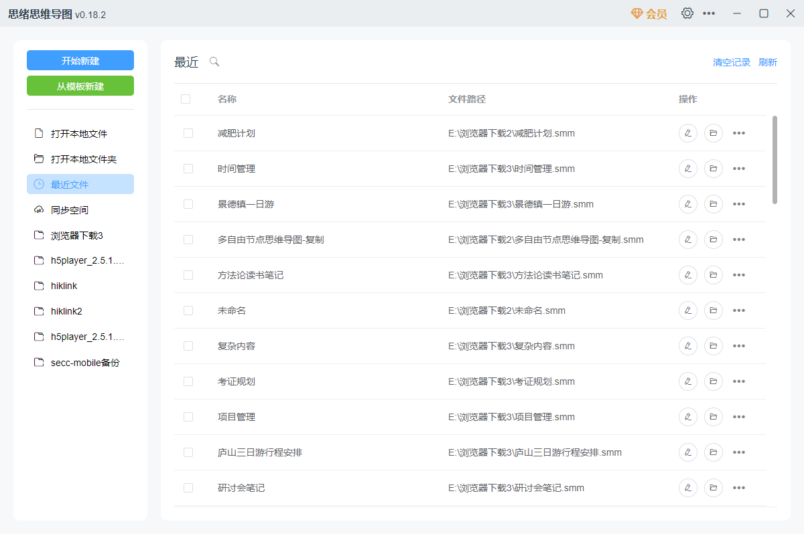
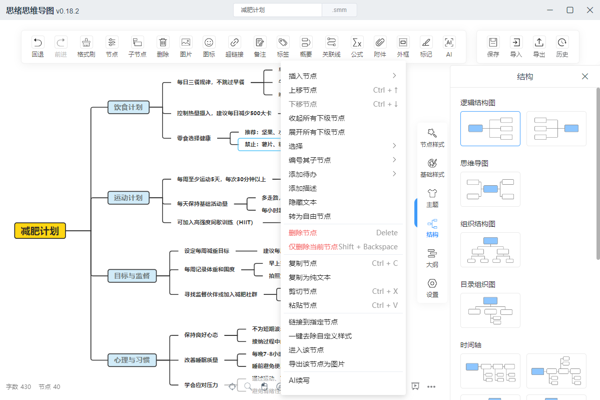
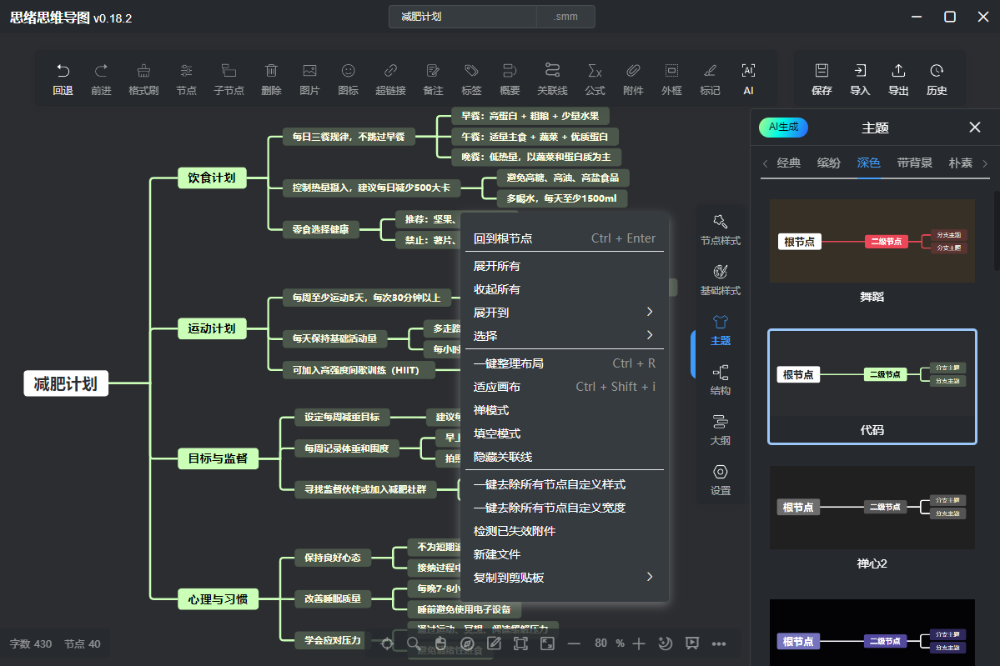
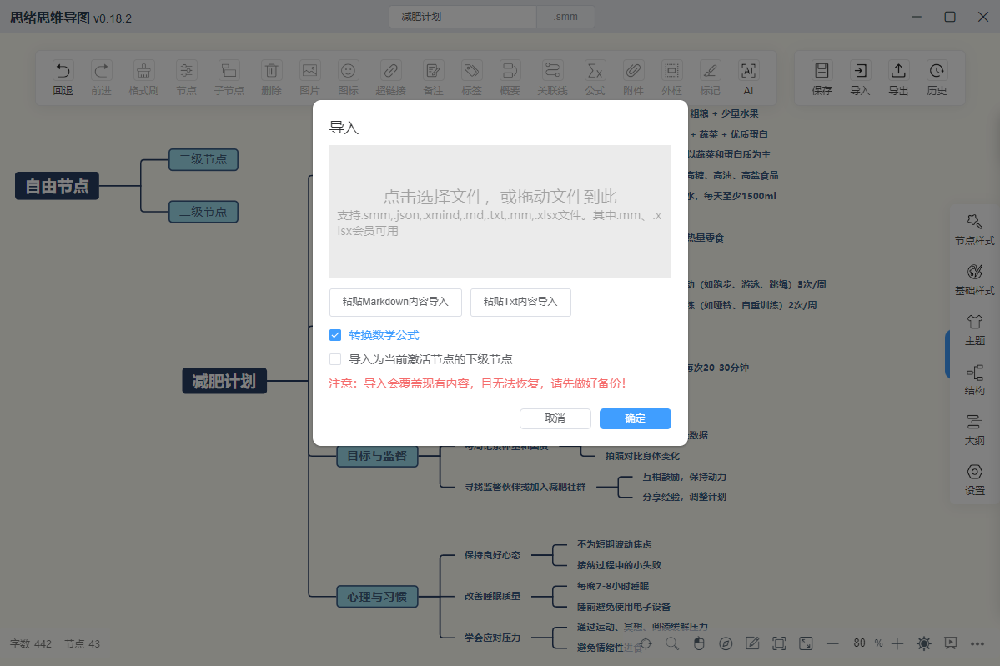

# Simple mind map (Docker Containers)

[English](./README_EN.md) | 中文

> 中文名：思绪思维导图。一个简单&强大的 Web 思维导图库和思维导图软件。

本项目包含两部分：开源的JavaScript库和闭源的客户端软件。

# 库、Web

> 即本仓库中的代码，目前已进入低维护状态。

- 一个 `js` 思维导图库，不依赖任何框架，可以用来快速完成 Web 思维导图产品的开发。

>  开发文档：[https://wanglin2.github.io/mind-map-docs/](https://wanglin2.github.io/mind-map-docs/)

- 一个 Web 思维导图，基于思维导图库、`Vue2.x`、`ElementUI` 开发，支持操作电脑本地文件，可以当做一个在线版思维导图应用使用，也可以自部署和二次开发。

> 在线地址：[https://wanglin2.github.io/mind-map/](https://wanglin2.github.io/mind-map/)

了解更多信息：[README](./README_MORE_ZH.md)。

# 客户端、插件

> 客户端和插件代码不开源，正在积极开发维护中。

---

基于 `Gin` 框架构建跨平台 `HTTP` 服务，通过 `Docker` 的多平台构建能力，实现 `mind-map` 在不同硬件架构上运行使用。

* 跨平台兼容：支持 `amd64` `arm64 | arm/v8` `arm/v7`
* 开箱即用：预配置 `mind-map` 静态文件，无需额外运行时依赖

支持Windows、Mac及Linux系统；支持中文、英文、中文繁体、越南语、俄语语言。

如在部署过程中遇到镜像启动失败等相关问题, 请提 [issue](https://github.com/hraulein/mind-map/issues)

- 目前容器的运行环境为 `scratch`(不包含 `sh/bash`), 不影响 mind-map 的运行  
如需挂载你自定义的 `mind-map` 的静态文件, 将你的文件目录映射到容器内部的 `/app` 下即可

- Obsidian插件

下载地址：[Github](https://github.com/wanglin2/obsidian-simplemindmap/releases)

- UTools插件

已上架[uTools](https://www.u.tools/)插件应用市场，可直接在`uTools`插件应用市场中搜索`思绪`进行安装，也可以直接访问该地址：[主页](https://www.u-tools.cn/plugins/detail/%E6%80%9D%E7%BB%AA%E6%80%9D%E7%BB%B4%E5%AF%BC%E5%9B%BE/)，点击右侧的【启动】按钮进行安装。
