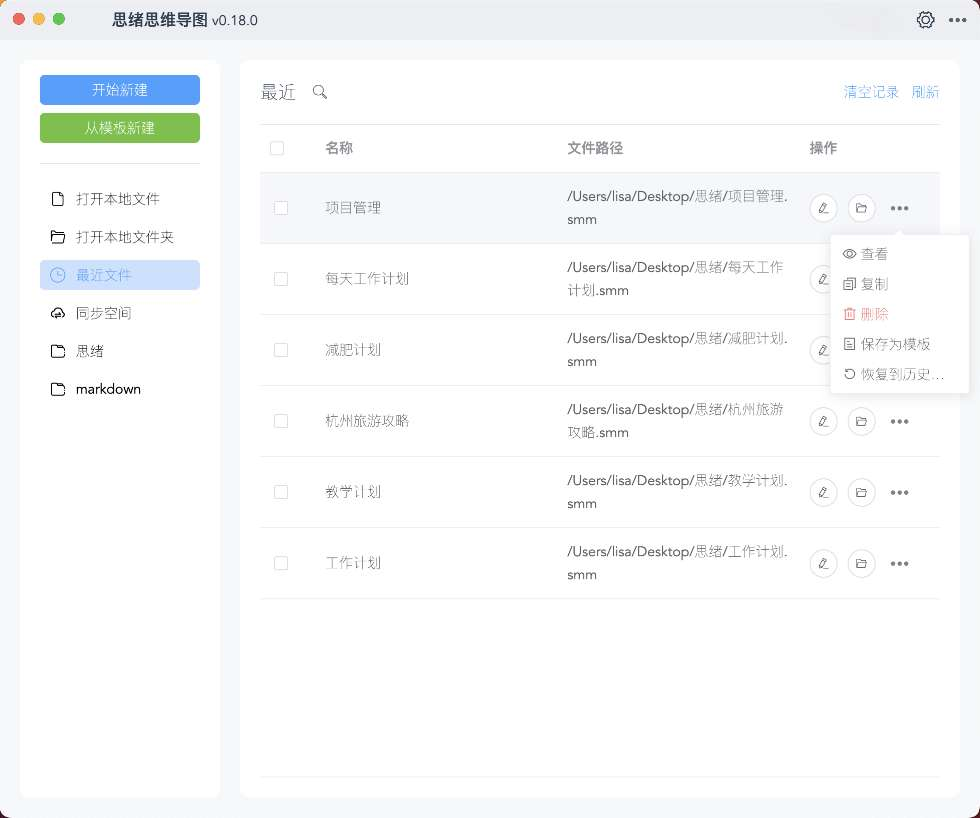
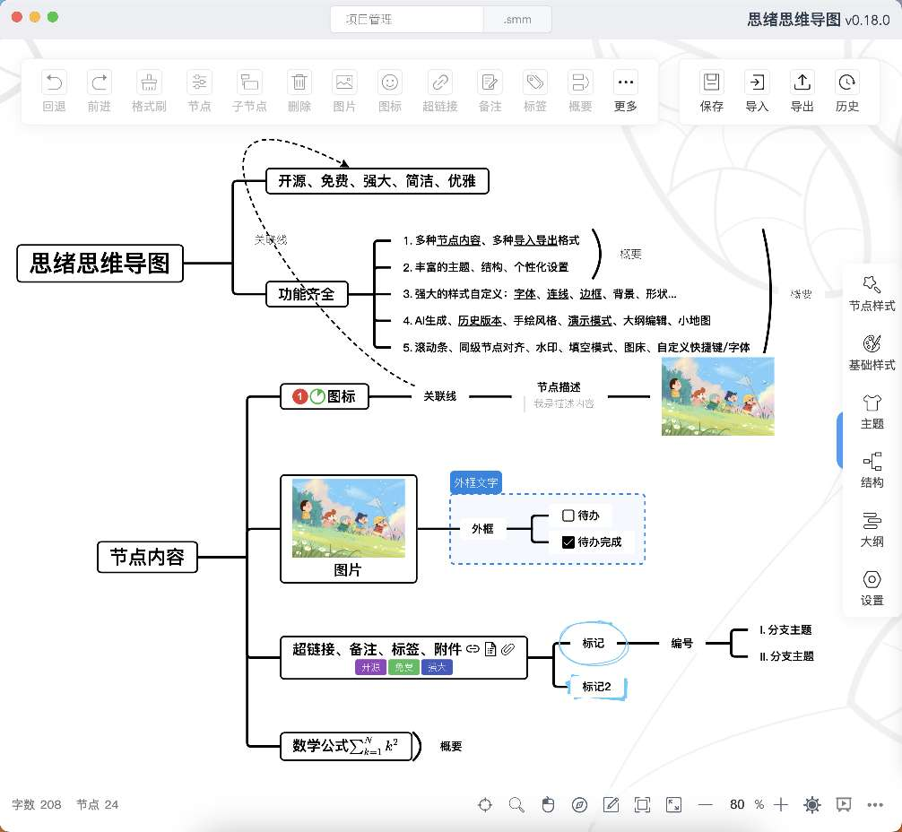
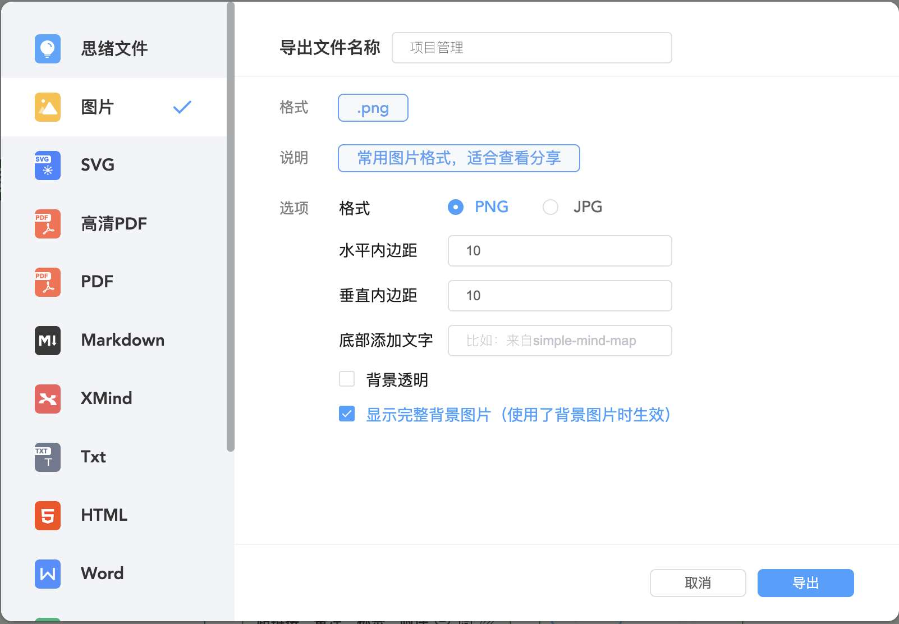
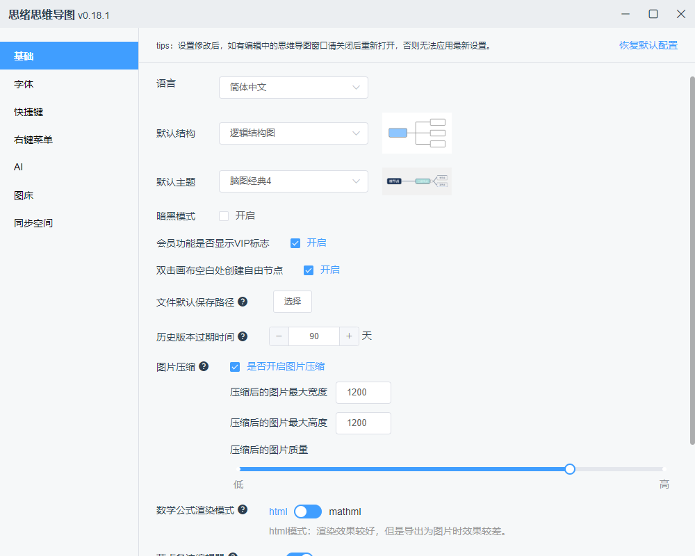

# Simple mind map (Docker Containers)

[](https://github.com/hraulein/mind-map/actions)
[](https://github.com/hraulein/mind-map/)
[](https://hub.docker.com/r/hraulein/mind-map/)
[](https://hub.docker.com/r/hraulein/mind-map/)
[](https://github.com/hraulein/mind-map/issues)
[](https://www.npmjs.com/package/simple-mind-map)


---

中文 | [English](./README_en.md)

---

本地化存储，隐私优先，数据安全，软件无需联网即可使用！

- [x] 1.支持创建无限数量的文件、节点（自由节点）；支持创建使用模板；
- [x] 2.提供丰富的设置：基础设置、自定义字体/快捷键/右键菜单/图标、图床配置、AI配置、webdav云同步配置等等，可玩性很高；
- [x] 3.支持思维导图、逻辑结构图、目录组织图、组织结构图、时间轴、鱼骨图、表格等多种结构类型；
- [x] 4.内置上百个丰富好看的主题，也支持自定义主题及AI生成主题；
- [x] 5.节点支持添加文本、图片、链接、图标、备注、附件、标签、概要节点、关联线、外框、标记、待办、描述、编号、数学公式等丰富内容；
- [x] 6.支持导入XMind、FreeMind、Markdown、Txt、Xlsx等格式文件；支持导出为PNG、XMind、SVG、PDF、Markdown、Txt、Xlsx、FreeMind、Mermaid、Html等格式；
- [x] 7.丰富的样式设置：文字、边框、背景、形状、线条、内外边距、图片标签布局等等；
- [x] 8.支持历史版本管理、演示模式、AI生成、手绘风格、大纲编辑、水印、滚动条、同级节点对齐、小地图、进入指定节点、彩虹线条、节点双向链接、搜索替换等等实用有趣的功能；

支持Windows、Mac及Linux系统、支持中文、英文、中文繁体、越南语、俄语语言。

下载地址：[Github](https://github.com/wanglin2/mind-map/releases)、[百度网盘](https://pan.baidu.com/s/1C8phEJ5pagAAa-o1tU42Uw?pwd=jqfb)、[夸克网盘](https://pan.quark.cn/s/2733982f1976)

* 跨平台兼容：支持 `amd64` `arm64 | arm/v8` `arm/v7`
* 开箱即用：预配置 `mind-map` 静态文件，无需额外运行时依赖









- Obsidian插件

如在部署过程中遇到镜像启动失败等相关问题, 请提 [issue](https://github.com/hraulein/mind-map/issues)

- 目前容器的运行环境为 `scratch`(不包含 `sh/bash`), 不影响 mind-map 的运行  
如需挂载你自定义的 `mind-map` 的静态文件, 将你的文件目录映射到容器内部的 `/app` 下即可

- 目前 `httpdGIN` 采用配置文件形式读取配置, 如需自定义配置, 请先将容器内部的 `/conf.d/` 目录拷贝出来后再挂载

## 使用方式

> 本项目开源版本，即本仓库中的代码（npm包、web示例）已停止更新，不再维护！

- 一个 `js` 思维导图库，不依赖任何框架，可以用来快速完成 Web 思维导图产品的开发。

```
services:
  mind-map:
    image: hraulein/mind-map:latest
    container_name: mind-map
    restart: always
    ports:
      - "8080:8080"  
    volumes:                   
      - ./your_config_dir:/conf.d
  #   - ./your_dist_dir:/app                               # 如果你想自定义 mind-map 的静态文件


```

2\. `docker cli`

```
docker run -d --name mind-map -p 8080:8080 -v ./your_config_dir:/conf.d hraulein/mind-map:latest
```

## nginx 配置参考

- `HTTP` 重定向 `HTTPS` 

```
# /etc/nginx/conf.d/00-redirect.conf

server {
    listen 80 default_server;
    listen [::]:80 default_server;
    return 301 https://$host$request_uri;
}
```

- `SSL` 证书相关配置  

``` 
# /etc/nginx/conf.d/include/ssl_parameter

ssl_certificate '/etc/nginx/*****/*****/fullchain.cer';    # <<< 替换为实际的证书地址
ssl_certificate_key '/etc/nginx/*****/*****/*****.key';    # <<< 替换为实际的证书地址
ssl_trusted_certificate '/etc/nginx/*****/*****/ca.cer';   # <<< 替换为实际的证书地址
ssl_session_cache shared:SSL:1m;
ssl_session_timeout 10m;
ssl_session_tickets off;
ssl_prefer_server_ciphers on;
ssl_ciphers 'ECDHE-ECDSA-AES256-GCM-SHA384:ECDHE-RSA-AES256-GCM-SHA384:ECDHE-ECDSA-CHACHA20-POLY1305:ECDHE-RSA-CHACHA20-POLY1305:ECDHE-ECDSA-AES128-GCM-SHA256:ECDHE-RSA-AES128-GCM-SHA256:ECDHE-ECDSA-AES256-SHA384:ECDHE-RSA-AES256-SHA384:ECDHE-ECDSA-AES128-SHA256:ECDHE-RSA-AES128-SHA256';
ssl_protocols TLSv1.2 TLSv1.3;
ssl_stapling on;
ssl_stapling_verify on;
resolver 8.8.8.8 1.1.1.1 valid=300s;
resolver_timeout 5s;
add_header Strict-Transport-Security "max-age=31536000" always;
```

- `nginx` 反向代理配置

``` 
# /etc/nginx/conf.d/mind-map.conf

server {
    listen 443 ssl;
    listen [::]:443 ssl;
    http2 on;
    include ./conf.d/include/ssl_parameter;  
  
    server_name mind-map.hraulein.localhost;               # <<< 替换为你的域名
    set $IPADDR 172.16.19.156;                             # <<< 替换为你服务器的内网 IP 地址

    location / {
        proxy_pass http://$IPADDR:8080;                    # <<< 替换为 mind-map 服务实际映射端口
        proxy_set_header Host $host;
        proxy_set_header Upgrade $http_upgrade;
        proxy_set_header Connection upgrade;
        proxy_set_header Accept-Encoding gzip;
    }    
    # include ./conf.d/include/err_pages;
}
```

## 支持一下

如果 Docker 镜像对你有帮助 , 不妨请我喝杯阔落解解馋~


